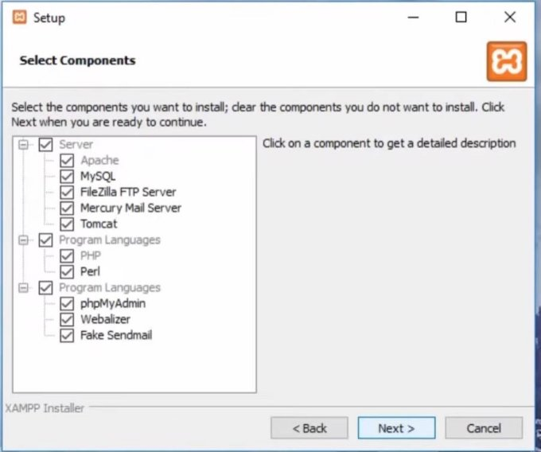
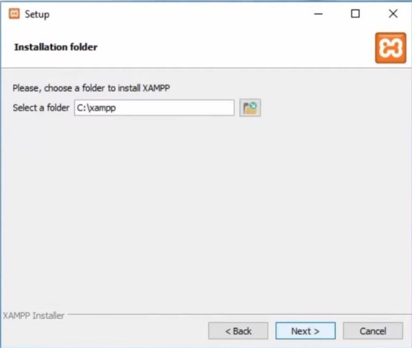
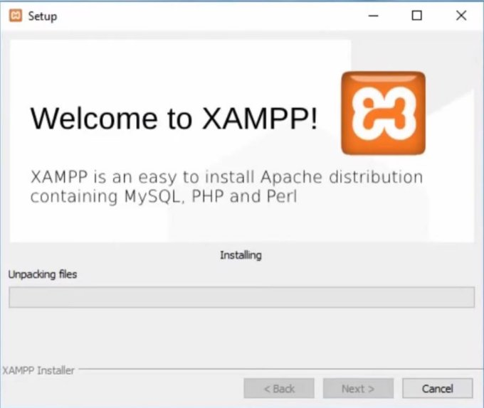
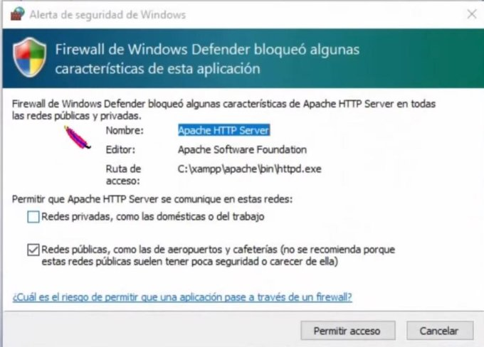
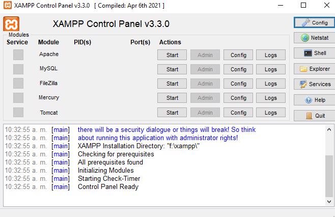
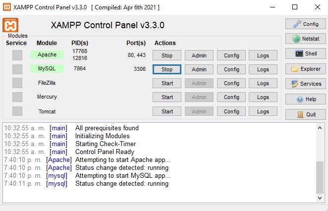
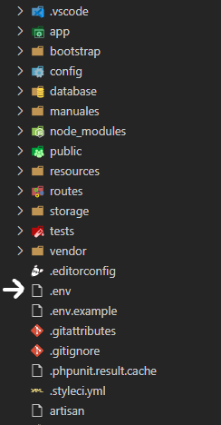

Manual de instalación de la prueba

En este manual estarán presentes el paso a paso necesario para poder realizar la instalación del proyecto Windows

Para la instalación del proyecto en Windows será necesario tener:

- [XAMPP](https://sourceforge.net/projects/xampp/)
- PHP >= 8.2 (Esta versión viene con el instalador de XAMPP)
- MySQL (Tambien viene incluída en el instalador de XAMPP)
- [Composer](https://getcomposer.org/Composer-Setup.exe)
- [Microsoft Visual Studio Code](https://code.visualstudio.com/) o cualquier editor de código que guste.
- [Github Desktop](https://central.github.com/deployments/desktop/desktop/latest/win32) (Opcional)

**Instalación de XAMPP.**

Es necesario descargar e instalar XAMPP. En la página oficial de XAMPP hay un Wizzard de toda la vida cuya complejidad se limita a "Siguiente->Siguiente->Instalar"

Abrir el instalador de Xampp. Se recomienda dejar los servicios que sugiere el Wizzard y le da click en siguiente.



Al darle siguiente, le aparecerá la ubicación de instalación del XAMPP. Se recomienda dejar la configuración por defecto.



Una vez hechos los pasos anteriores, bastará con darle al botón de "siguiente" hasta que se muestre la barra de progreso con la instalación de XAMPP y sus paquetes.



En cuanto instale XAMPP, mostrará una alerta de seguridad de windows. Deberá concederle acceso y los permisos necesarios para poder poner en funcionamiento XAMPP. Tanto permisos de acceso a redes públicas como a las privadas.

Una vez hecho todos los pasos anteriores, ya tendría instalado XAMPP. Cuando esté instalado, deberá abrirlo:

 

Y clickear en el botón **Start** para los servicios de *Apache* y *MySQL* 



**Instalación de Composer**

Al clickear sobre el enlace del composer, debería descargar inmediatamente la última versión del instalador del Composer.

Al igual que en la aplicación anterior, bastará con abrir el ejecutable y seguir la misma instrucción anterior. "siguiente->siguiente->instalar"


Al abrir el ejecutable, es necesario indicarle a cuales usuarios le instalará el composer. Puede instalarlo para todos los usuarios que usen el ordenador o solo para aquel que actualmente tiene la sesión activa.


Le recomendamos **NO** marcar la opción de *Developer mode*, solo darle click a Siguiente y proceder con el resto de la instalación.


Es necesario especificar cuál será la versión de PHP que usará el composer para la instalación. Se recomienda usar la versión de PHP que provee el instalador de XAMPP. Usualmente la ruta de este PHP viene pre-cargada en el instalador de composer; En caso de que no, será necesario buscarla manualmente. Es recomendado que al buscar y asignar una ruta para el ejecutable/consola de PHP, utilice la que está disponible en xampp (O en el servidor PHP de su preferencia)


Le daremos al botón de "instalar" y esperaremos a que el composer termine el proceso de instalación. 

**Instalación de Artisan mediante Composer**

Una vez instalado el composer, abriremos una terminar con permisos de administrador y ejecutaremos el comando:

```console
composer global require laravel/installer
```

Esto descargará y dejará en caché las dependencias que requiere Laravel para su instalación

**Descarga del proyecto**

Aquí es libre de o bien utilizar la herramienta de GitHub Desktop (Es necesario que tenga una cuenta de GitHub para poder hacer uso de la herramienta) o descargar el [archivo Zip](https://github.com/JuanRobles2164/prueba_baguer_sas/releases/tag/v1.0.0) disponible en el repositorio maestro.

Si decide descargar el proyecto desde el archivo Zip, es necesario descomprimirlo. 

**Configuración del proyecto**

La carpeta descomprimida del proyecto, deberá abrirla con el editor de código de su preferencia. Se realizó principalmente en **Visual Studio Code** por comodidad. Parte de estas configuraciones podrá suplirlas tambien con su editor de código favorito y la consola del sistema operativo (CMD).

Una vez abierta la carpeta del proyecto, deberá ejecutar el siguiente comando en esta carpeta: 

```console
composer install
```

Y el comando:


```console
php artisan key:generate
```

La consola de comandos estará instalando los paquetes, librerías y extras que requiere el framework para su correcto funcionamiento.

Una vez termine de instalar toda la librería, deberá abrir el archivo .env El cual se encuentra en la raíz del proyecto



Una vez abierto, deberá cambiar las credenciales que corresponden a la base de datos que serán parte del proyecto.


Cuando tenga las credenciales preparadas, deberá correr los siguientes comandos: 

```console
php artisan migrate
```

Y el comando:

```console
php artisan key:generate
```

El comando se encargará de crear las tablas y llenarlos con los datos mínimos para el correcto funcionamiento del proyecto.

Finalmente, una vez tenga el composer instalado y migrada la base de datos, deberá correr el comando: 

```console
php artisan serve
```

Laravel lanzará una instancia de un servidor local para que pueda probar la aplicación. Dependiendo de su configuración, cambiará entre una ubicación u otra, pero la url por defecto en el que quedará la aplicación corriendo será: [localhost](http://127.0.0.1:8000/)

